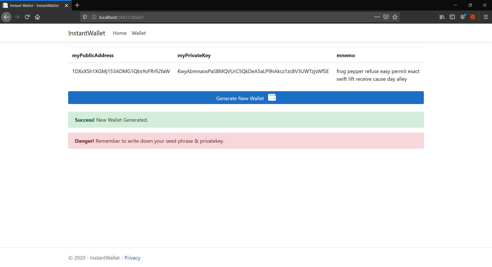

# Insta-Wallet
Instant Browser Based Bitcoin Wallet.

Uses the NBitcoin C# Library to generate a real working Bitcoin wallet on the main net. Allows users to generate a Bitcoin wallet on the fly for receiving payments without the hastle of having to login to a Trezor/Exchange/etc.

To Do: 
- Add Transaction Signing 
- Add All Previous Transactions List
- Add Additional Alt-Coins

